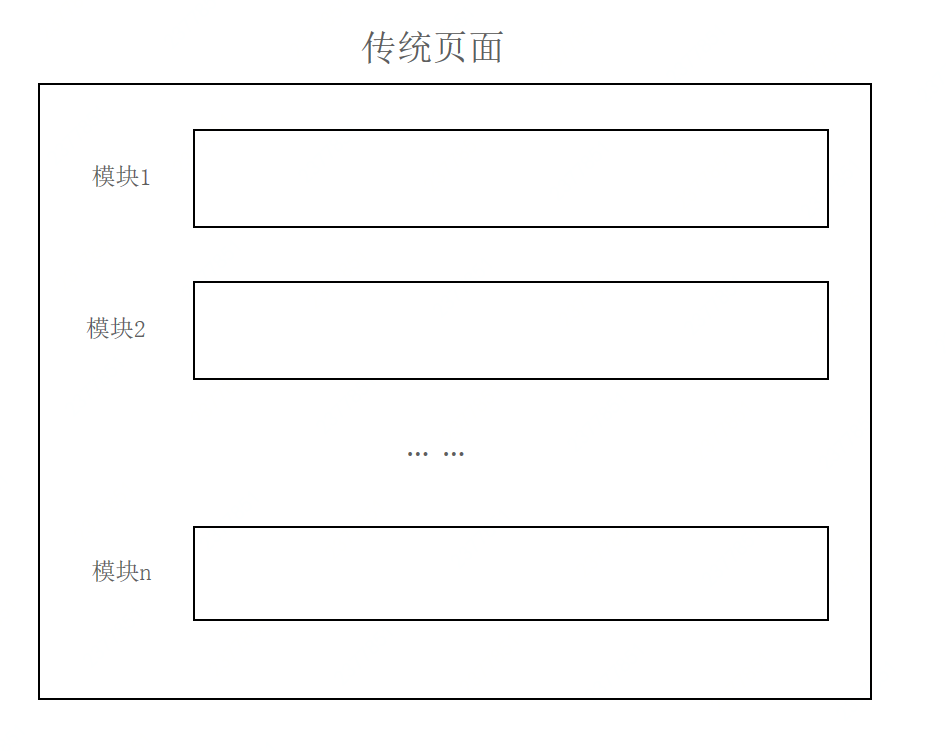
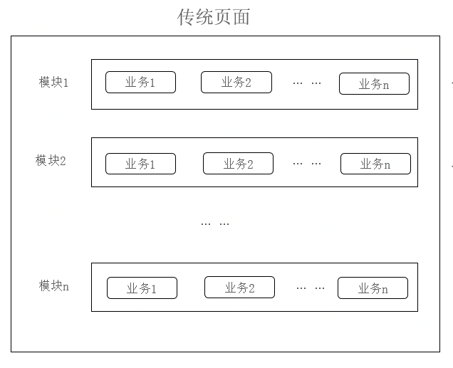
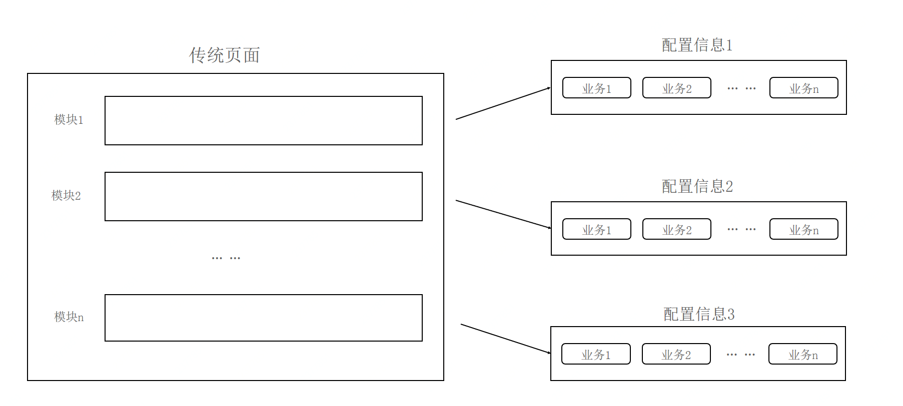
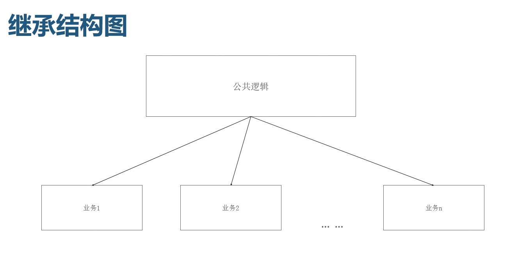
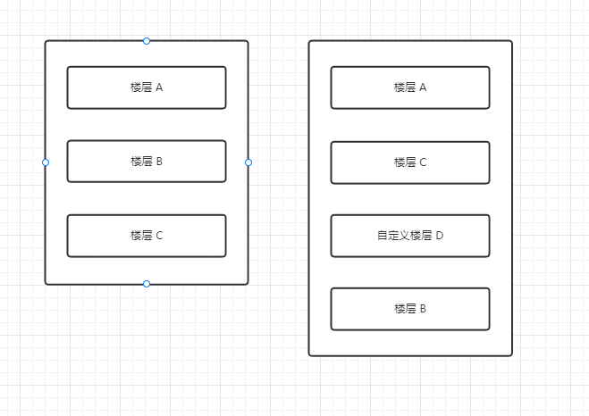

# 订单详情页支持多条业务线的总结

## 项目背景
可以参考[消费医疗三合一项目架构演进](https://jelly.jd.com/article/5fe845c4b402750151b4f666)了解一下本项目的历史演进


三合一项目，聚合了大量有相似、相同的业务逻辑的业务线，其中包含了一些已有的聚合页，比如：预约页、预约详情页、门店选择页、联系人列表页等等，这些聚合页，被很多业务线同时使用着。

本期要介绍的订单详情页，就是三合一项目中的一个新的页面。且准备为其他业务线共用，成为一个新的聚合页。

## 订单详情页
自营齿科的订单详情页 + 自营医美的订单详情页
<div>


</div>


## 页面结构

一个普通的页面，是有几个模块组成


封装一个可以被不同业务线使用的页面，有很多办法。

最暴力的方式，就是将不同业务线的业务逻辑，在页面中直接做硬编码判断处理。


```js
if (TYPE === 'A') {
  return <div>不同业务线是否显示</div>
} else {
  return null;
}
```

但这样做的缺点是显而易见的，不同业务线的不同逻辑，在一处高度耦合，逻辑判断复杂，可能不仅其他人读不懂此处代码，作者本人也读不懂。
这样做的优点也是显而易见的，简单、直接，所见即所得。所以他的应用场景通常局限于简单的业务逻辑，最好只有两个业务线共用，再多逻辑就混乱了。

本次要封装的订单详情页，是要面向数条业务线共用的，所以这种方式不适合。

这种方式，还有个改进版。

不同业务逻辑耦合在一起，太难看，可以提取出去，单独维护，这样看起来清爽很多。



想达成上图的效果，需要一定的数据转化能力。需要将不同业务线的不同表现，用数据描述出来。在页面中，读取相关数据，执行相关代码。

描述数据可以以功能模块维度来区分，也可以以业务线维度来区分。

```js
// 功能模块维度来区分
export default const config = {
  show: {
    A: true,
    B: false
  }
}

// 业务线维度来区分
// export default const config = {
//   A: {
//     show: true,
//   },
//   B: {
//     show: false
//   }
// }
```

```js
import config from './config.json';

{config.show[TYPE] && <div>不同业务线是否显示</div>}
```

维护这样的代码，会相对清爽一些。后期再介入其他业务线，只需要维护相应 config 数据就行了。

上面的两种方式，从结构上来讲，是一致的，就是不同业务线共用一个页面。那么缺点也是一致的，其中一条业务线做修改，其他业务线有可能被影响，对系统的稳定性，是个挺大的挑战。

为了改变这个状况，经过研究，创造出一个继承模式：

利用 React 的类组件特点，将公共逻辑部分提取出来，封装为父组件。
不同业务线实现时，继承于此父组件，实现各自逻辑的子组件即可。
```js
// 伪代码
class CommonBussiness {
  componentDidMount() {
    this.init();
  }
  init() {
    // ... 
    this.childInit();
  }
  render() {
    return (
      <div>公共部分</div>
    )
  }
}
```
```js
// 伪代码
class ABussiness extends CommonBussiness {

  childInit() {
    // do something
    console.log('A 业务线初始化')
  }

  render() {
    return (
      <>
        <div>A 业务线</div>
        {super.render()}
      </>
    )
  }
}
// 伪代码
class BBussiness extends CommonBussiness {

  childInit() {
    // do something
    console.log('B 业务线初始化')
  }

  render() {
    return (
      <>
        <div>B 业务线</div>
        {super.render()}
      </>
    )
  }
}
```

这样的做法，可以使每条业务线，独自维护自己的一套代码。将修改代码时的影响范围压缩到最小。
当要修改某条业务线特有逻辑时，只修改相应那部分子组件即可，其他业务线不会受影响。
当要修改公共逻辑时，修改父组件即可。

## 公共逻辑
父组件的封装，基于不同业务线的公共逻辑。将公共部分提取出来。
有哪些可以提取出来呢？
1. 初始化逻辑
```js
initOrderDetail() {
  api.getOrderDetail(param).then(res => {
    this.setState({
      orderDetail: res.data
    })
  })
}
```
2. 页面内各模块样式
父组件中内置了一些组件。可以让子组件通过配置灵活展示。
```js
floorStatus = (options) => {
  return <Status key='status' {...options} />;
};
floorPhone = (options) => {
  return <Phone key='phone' {...options} />;
};
render() {
  let { floors = [] } = this.options;
  return (
    <div>
      {floors.map(({ type, ...others }) => {
        if (typeof type === 'function') {
          return type(); // 自定义楼层
        }
        if (typeof this[`floor${type}`] === 'function') {
          return this[`floor${type}`](others); // 预制楼层
        }
        return <div>楼层数据错误</div>;
      })}
    </div>
  );
}
```
子组件内 options 结构
```js
options = {
  floors: [
    {
      type: 'Status',
      infoMap: this.StatusMap,
      className: '',
    },
    { type: 'Phone' },
  ],
};
```

## 楼层的概念

前端的难度，不在于实现某些已知功能，而在于要为未知功能做准备。

此订单详情页面，在不同业务线中展示样式，大致相同，可以封装出一些统一的组件，供其使用。

如果未来有新的业务线介入，样式不同了，比如需要插入一则广告位，增加了页面样式的多样性，改变了原有的布局，那该如果扩展？

这里便引入了楼层的概念。

将页面，划分为很多楼层，每个楼层其实就是一个组件。

可以通过配置，将楼层随意组合，改变楼层的顺序。**就像搭积木一样。**

也支持自定义楼层。


这样便增强了扩展性：
1. 如果各业务线需要统一增加个组件，就可以增加个公共的楼层。
2. 如果某个业务线，需要独特的组件，他可以封装一个自定义楼层，供自己使用。

```js
options = {
  floors: [
    // 状态栏楼层
    {
      type: 'Status',
      infoMap: this.StatusMap,
      className: '',
    },
    // 联系人楼层
    { type: 'Phone' },
    // 自定义广告楼层
    { type: () => (<div>自定义广告位</div>)},
    // 底部按钮楼层
    { type: 'BottoButton'}
  ],
};
```

## 结语：
没有一款模式，是永远正确的。我们要做的就是找到更符合应用场景的模式。
