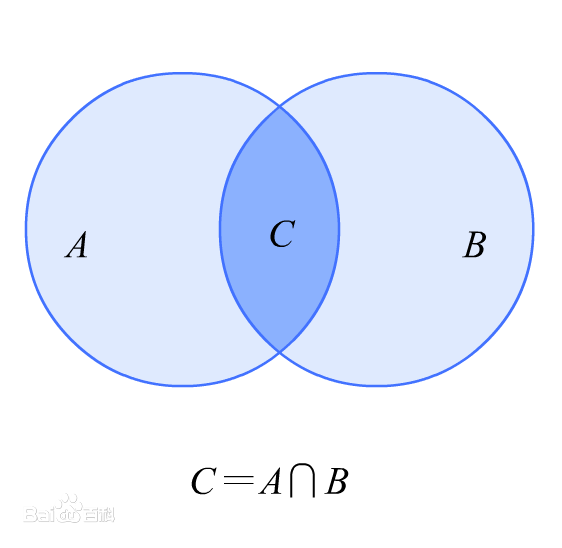
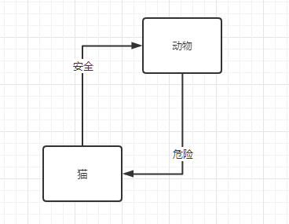
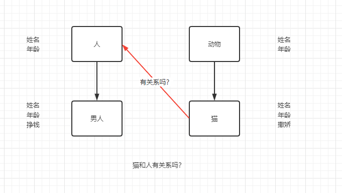
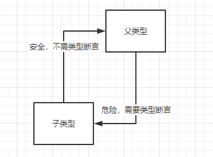
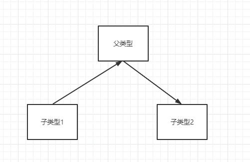

# 用集合的方式看待 TypeScript

本文讲的只是一种思维，一种解题方式。
一道题可以用很多方式来解答，比如鸡兔同笼问题，可以用方程解答，可以用算术方式解答，还有很多表象解法：猜测法、假设法、鸡翅法、抬腿法
在程序编程中，同一段代码，也可以有很多种解读，这也是很多人被奉为大神的原因，一个很有深度的问题，可以用通俗的语言来表达出来。

本文讲的是用集合的方式，来看待 TypeScript，对 TS 中存在的现象，用集合的方式，做解答。让很多让人感到困惑的现象，变得顺理成章。

物理学中的左手定则、右手定则，就是一种思维模式的替换。用生活中常见的左手、右手，就可以推导出电、磁、受力方向，无需理解复杂的底层原理。让人能迅速介入到电磁学科中。真正的深入浅出。

阅读本文需要 TS 基础，最好有初级实战经验

[TypeScript官方文档](https://www.tslang.cn/docs/handbook/basic-types.html)

## TS 类型的另一种看法：集合

## 数学中的集合概念
#### 空集
有一类特殊的集合，它不包含任何元素，如{x|x∈R x²+1=0} ，称之为空集，记为∅。空集是个特殊的集合，它有2个特点：
空集∅是任意一个非空集合的真子集。
空集是任何一个集合的子集。

#### 子集
设S，T是两个集合，如果S的所有元素都属于T ，即 则称S是T的子集，记为 。显然，对任何集合S ，都有 。其中，符号 读作包含于，表示该符号左边的集合中的元素全部是该符号右边集合的元素。如果S是T的一个子集，即 ，但在T中存在一个元素x不属于S ，即 ，则称S是T的一个真子集。


#### 交集定义
由属于A且属于B的相同元素组成的集合，记作A∩B（或B∩A），读作“A交B”（或“B交A”），即A∩B={x|x∈A,且x∈B}， 如图1所示。注意交集越交越少。若A包含B，则A∩B=B，A∪B=A。

#### 并集定义
由所有属于集合A或属于集合B的元素所组成的集合，记作A∪B（或B∪A），读作“A并B”（或“B并A”），即A∪B={x|x∈A,或x∈B}，如图1所示。注意并集越并越多，这与交集的情况正相反。

#### 相等集合
如果两个集合S和T的元素完全相同，则称S与T两个集合相等，记为S=T 。显然有如下关系：

其中符号称为当且仅当，表示左边的命题与右边的命题相互蕴含，即两个命题等价。

## TS 中的类型
TS 中的类型可以用集合的方式来看待
比如 type A = 'a' | 'b';
代表着声明个类型 A，A 类型的变量的取值可能性只能是 'a' 或者 'b'。
换成集合方式来说，就是 A 类型的变量只能是集合 {'a', 'b'} 中的元素。

列举一些常见类型，由集合内元素个数从小到大排序：
### 空类型
集合内没有元素
never 类型表示的是那些永不存在的值的类型。不存在值，就是空集。

### 单元类型
集合内，只有1个元素。
系统提供的：undefined、null
可以自定义：type A = 1;

### 只有两个值的类型
系统提供的：boolean
可以自定义：type B = 1 | 2;

### 无限值类型
如果想表示所有数字，这有点难 type Numbers = 1 | 2 | 3 ..., 所以系统提供了一些已定义好的集合。
系统提供的：number、string

### 复合类型
元组

例如：表示坐标点，(x, y)
```js
type Point = [number, number];
```

### 乘积类型
两个集合 S ={A，B，C} T = {X，Y}
集合 S*T 为多少？

应该是S*T={(a,x),(a,y),(b,x),(b,y),(c,x),(c,y)}

元组：
[number, string]
记录
{a: number, b: string}


### 和类型(并集)
number | string
```typescript
type type12 = 1 | 2;
type type123 = 1 | 2 | 3;
type number = 1 | 2 | 3 ... ...
```
number、string、boolean 是系统提供的一种集合

做个小测试吧：
let x : [number, string] = [42, 'Hello'];
A: 基本类型
B：和类型
C：乘积类型
D：既是和类型，也是乘积类型

给定 enum Two {A, B} 和 enum Three {C, D, E}，元组类型 [Two, Three] 有多少个可能的值？
给定 enum Two {A, B} 和 enum Three {C, D, E}，类型Two | Three有多少个可能的值？
<details>
<summary>查看答案</summary>
C

6种，乘积类型，2 × 3 = 6
5种， 和类型，2 + 3 = 5；
</details>

### 交叉类型 （交集）
A & B 包含 A 和 B 的成员的对象。
```ts
type A = {
  a: number
}
type B = {
  b: string
}
type AB = A & B;
let ab : AB = {
  a: 1,
  b: 'hello'
}
```

## 子类型（子集）

猫是动物 **√**
动物是猫，这句话有危险，可能是猫，可能是狗

### 子类型定义
- 名义子类型：显示声明一个类型是另一个类型的子类型，则二者构成子类型关系
- 结构子类型：一个类型具有另一个类型的所有成员，而且可能还有其他成员，那么前者是后者的子类型。

名义子类型：


在名义子类型中，猫和人是没有关系的。
但在结构子类型中，人和动物数据结构一致，猫是动物的子类，猫就是人的子类。

typescript 是结构子类型

```js
interface Named {
    name: string;
}

class Person {
    name: string;
}

let p: Named;
// OK, because of structural typing
p = new Person();
```
在使用基于名义类型的语言，比如C#或Java中，这段代码会报错，因为Person类没有明确说明其实现了Named接口。

TypeScript的结构性子类型是根据JavaScript代码的典型写法来设计的。 因为JavaScript里广泛地使用匿名对象，例如函数表达式和对象字面量，所以使用结构类型系统来描述这些类型比使用名义类型系统更好。

### 对象的子类型
type A = {name: string} 与 type B = {name: string, location: string} 子类型关系？
**B 是 A 的子类型**
```js
interface Named {
    name: string;
}

let x: Named;
// y's inferred type is { name: string; location: string; }
let y = { name: 'Alice', location: 'Seattle' };
x = y;
```

### 函数的子类型1（参数有子类型关系，返回值相同）
let x = (a: number) => 0;
let y = (b: number, s: string) => 0;
x、y 的子类型关系？
**x 是 y 的子类型**
x 只能处理 number 数据
y 不仅能处理 number 数据（第二参数传 undefined），还能处理（number, string）数据
```js
let x = (a: number) => 0;
let y = (b: number, s: string) => 0;

y = x; // OK
x = y; // Error
```
### 函数的子类型2（参数相同，返回值有子类型关系）
let x = () => ({name: 'Alice'});
let y = () => ({name: 'Alice', location: 'Seattle'});
x、y的子类型关系？
**y 是 x 的子类型**
将函数看成一个工厂
x 是个生产巧克力的，自然可以生产夹心巧克力
y 是个生产夹心巧克力的
x 是 y 的父类型
```js
let x = () => ({name: 'Alice'});
let y = () => ({name: 'Alice', location: 'Seattle'});

x = y; // OK
y = x; // Error, because x() lacks a location property
```

### 类型断言与子类型关系
有时候你会遇到这样的情况，你会比TypeScript更了解某个值的详细信息。 通常这会发生在你清楚地知道一个实体具有比它现有类型更确切的类型。

通过类型断言这种方式可以告诉编译器，“相信我，我知道自己在干什么”。 类型断言好比其它语言里的类型转换，但是不进行特殊的数据检查和解构。 它没有运行时的影响，只是在编译阶段起作用。 TypeScript会假设你，程序员，已经进行了必须的检查。

类型断言需要有子类型关系时才能使用。
子类型数据赋值给父类型变量，是安全的，这时不需要类型断言；
```js
interface Named {
  name: string;
}
let x: Named = {name: 'Tom'};

interface Named2 {
  name: string;
  location: string;
}
let y: Named2 = { name: 'Alice', location: 'Seattle' };
x = y; // OK
```
父类型数据赋值给子类型变量，是不安全的，这时需要类型断言；
```js
y = x as Named2;
```


#### 子类型间转化

子类型1 转化成 子类型2 应该怎么做？
用父类型做中转:
```js
interface Named {
  name: string;
}

interface Named2 {
  name: string;
  location: string;
}
let y: Named2 = { name: 'Alice', location: 'Seattle' };

interface Named3 {
  name: string;
  location3: string;
}
let x: Named3 = y as Named as Named3;
```

那两个类型间转化，每次都要找个父类型
如果两个类型间没有明确的父类型，还要新建个父类型？这样太麻烦了
unknow 是所有类型的父类型:
```js
A as unknow as B
```

### 顶层类型
如果我们能够把任何值赋给一个类型，就称该类型为顶层类型，因为其他任何类型都是该类型的子类型。换句话说，该类型位于子类型层次结构的顶端。

unknown 是顶层类型 unknown = Object | null | undefined

### 底层类型
如果一个类型是其他类型的子类型，那么我们称之为底层类型，因为它位于子类型层次结构的底端。要成为其他类型的子类型，它必须具有其他类型的成员。因为我们可以有无限个类型和成员，所以底层类型也必须有无限个成员。这是不可能发生的，所以底层类型始终是一个空类型：这是我们不能为其创建实际值的类型。

never
